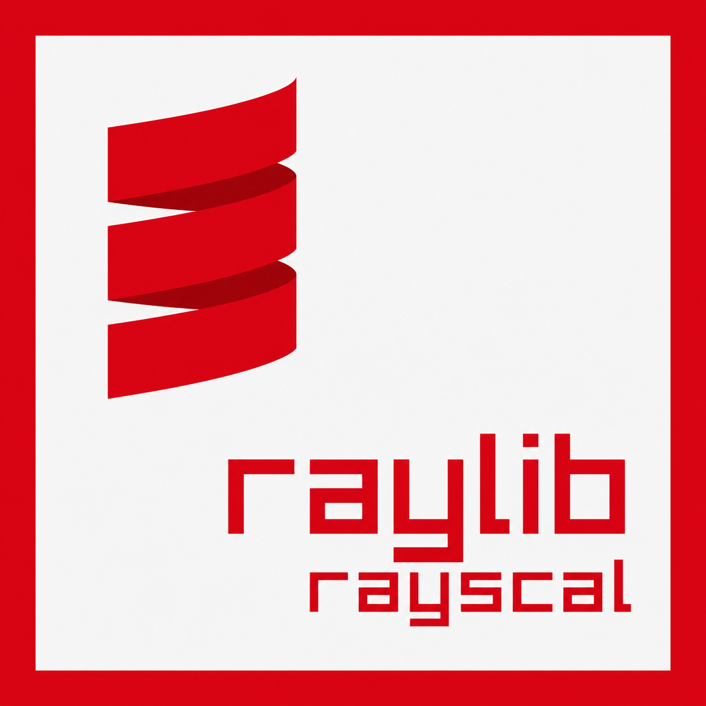

### rayscal

Scala Native bindings for [raylib](https://www.raylib.com/) 6.0.

[](https://github.com/RobertFlexx/rayscal/actions)
[](https://scala-lang.org)
[](https://scala-native.org)
[](https://www.raylib.com/)
[](LICENSE)

rayscal wraps raylib's C API in idiomatic Scala, producing a single native binary
via Scala Native. No JVM at runtime, no GC pauses, no FFI overhead beyond the
C interop layer. Write game loops and graphics code in Scala, compile to a
standalone ELF binary, ship it.

> ***VERY*** early experimental beta! expect things to **break!**
<br clear="left"/>

---

## What's in the box

- Window management, timing, FPS
- 2D drawing: shapes, text, textures, render targets
- 3D drawing: basic primitives, models, cameras
- Input: keyboard, mouse, gamepad, touch, gestures
- Audio: sound effects, music streams
- Shaders: typed uniform setters (float, vec2/3/4, int, matrix, texture)
- Image loading, generation, and manipulation
- Collision detection (2D and 3D raycasts)
- rlgl access for low-level OpenGL-style drawing
- raymath extern declarations (ready for a friendly wrapper layer)

Resource-owning types (`Texture2D`, `Shader`, `Sound`, `Music`, `Model`, `Font`,
`RenderTexture2D`) are managed handles with `with...` helpers for scoped
lifetimes. No dangling pointers, no double-frees.

## Quick example

```scala
import rayscal.*

@main def run(): Unit =
  Window.withWindow(800, 450, "hello rayscal"):
    Window.setTargetFps(60)

    while !Window.shouldClose do
      Drawing.frame:
        Drawing.clear(Colors.RAYWHITE)
        Drawing.text("Hello from rayscal!", 220, 200, 28, Colors.DARKGRAY)

        if Keyboard.isDown(Keys.Space) then
          Shapes.circle(400, 280, 48, Colors.SKYBLUE)
        else
          Shapes.circleLines(400, 280, 48, Colors.BLUE)
```

Build and run:

```bash
sbt run
```

## Requirements

- JDK 17+
- sbt 1.x
- Scala Native toolchain (Clang, LLVM, lld)
- raylib 6.0 installed as a shared library
- Linux (X11 or Wayland)

See [BUILDING.md](BUILDING.md) for detailed setup instructions, troubleshooting,
and how to use rayscal from your own sbt project.

---

## Examples

| Example | What it shows |
|---|---|
| `helloWindow` | Minimal window with centered text |
| `bouncingBall` | Frame-rate-independent movement |
| `keyboardInput` | Key state queries |
| `rlglTriangle` | Low-level rlgl immediate mode |
| `shapesGallery` | 2D shapes and mouse picking |
| `textureChecker` | Generated textures |
| `basic3d` | 3D primitives with a camera |
| `camera2d` | 2D camera with zoom/pan |
| `renderTexture` | Draw-to-texture (offscreen rendering) |
| `starRescue` | Complete arcade game with fixed timestep |

Run any example with `sbt <name>/run`, for example:

```bash
sbt starRescue/run
```

## Project structure

```
rayscal/
  modules/core/
    src/main/scala/rayscal/
      # Friendly wrappers
      Window.scala          # window lifecycle, DPI, fullscreen
      Drawing.scala         # frame(), text, clear, mode2D/3D, shader/blend/scissor
      Colors.scala          # named colors, rgba(), color utilities
      Shapes.scala          # 2D primitives (circles, rectangles, triangles, etc.)
      Shapes3D.scala        # 3D primitives (cubes, spheres, cylinders, etc.)
      Input.scala           # Keyboard, Mouse, Gamepads, Touch, Gestures
      Textures.scala        # load, draw, filter, wrap, cubemaps
      Images.scala          # load, generate, crop, resize, color ops
      Fonts.scala           # custom font loading and rendering
      Audio.scala           # Waves, Sounds, MusicStreams with scoped lifetimes
      Models.scala          # load/generate 3D models, material overrides
      Shaders.scala         # load, typed uniforms (float, vec2/3/4, int, matrix, texture)
      RenderTargets.scala   # offscreen rendering to texture
      Collisions.scala      # 2D and 3D collision/raycast queries
      Camera.scala          # Camera2D/Camera3D construction, update modes
      ScreenSpace.scala     # world-to-screen / screen-to-world conversion
      Rlgl.scala            # rlgl matrix stack, immediate mode, render state
      Vector.scala          # factory methods + extensions on Vector2/3/4
      Rect.scala            # rectangle utilities
      Time.scala            # frame time, elapsed time
      Utils.scala           # dropped files, paths
      ManagedResources.scala # managed handle base classes
      NativeCopies.scala    # safe pointer-based struct passing
      RaylibAbi.scala       # compile-time struct layout validation
    src/main/scala/rayscal/raw/
      Raylib.scala          # @extern declarations matching raylib C API
      Rlgl.scala            # @extern declarations for rlgl
      RayscalNative.scala   # @extern declarations for C shim layer
      RaymathNative.scala   # @extern declarations for raymath
      package.scala         # C struct type aliases (Color, Vector2, etc.)
    src/main/resources/scala-native/
      rayscal.c             # C shims for ABI-sensitive struct-by-value calls
  examples/                 # 11 example programs
```

---

## Architecture

rayscal has three layers:

**1. `rayscal.raw` -- FFI declarations**

Direct Scala Native `@extern` bindings that map 1:1 to raylib's C functions.
Names match raylib exactly: `InitWindow`, `BeginDrawing`, `DrawText`, etc.
Use these when you need something the friendly layer doesn't cover yet.

**2. `rayscal.raw.RayscalNative` -- C shim layer**

A small C file (`rayscal.c`) plus matching `@extern` declarations. These handle
raylib functions that return structs by value or take large structs as parameters.
Scala Native's `@extern` ABI lowering can be unreliable for these calls across
different toolchains. The shims receive pointers instead, making the interop
predictable.

**3. `rayscal.*` -- friendly wrappers**

Thin Scala objects that handle `Zone` allocation, `CString` conversion, and
resource lifecycle so you don't have to. They call through to `RayscalNative`
shims (for struct-heavy calls) or directly to `Raylib` (for scalar returns like
`GetScreenWidth` or `IsKeyDown`).

The rule of thumb: use the friendly layer. Fall back to `rayscal.raw` when you
need a function that hasn't been wrapped yet.

## Using assets

Put assets next to your project and load them by path:

```scala
import rayscal.*

@main def run(): Unit =
  Window.withWindow(800, 450, "Textures"):
    Textures.withTexture("assets/player.png"): player =>
      Window.setTargetFps(60)

      while !Window.shouldClose do
        Drawing.frame:
          Drawing.clear(Colors.RAYWHITE)
          Textures.draw(player, 100, 100, Colors.WHITE)
```

`with...` helpers guarantee cleanup. The texture is unloaded when the block
exits, even if an exception is thrown.

## Shader uniforms

```scala
Shaders.withShaderFromMemory(vertexCode, fragmentCode): shader =>
  val timeLoc = Shaders.location(shader, "time")
  val tintLoc = Shaders.location(shader, "tint")

  while !Window.shouldClose do
    Drawing.frame:
      Shaders.setFloat(shader, timeLoc, Time.elapsed.toFloat)
      Shaders.setVector3(shader, tintLoc, Vector.vector3(1.0f, 0.7f, 0.4f))
```

Available setters: `setFloat`, `setVector2`, `setVector3`, `setVector4`,
`setInt`, `setInts`, `setMatrix`, `setTexture`.

## Raw access

For functions without a friendly wrapper:

```scala
import rayscal.raw.Raylib
import scala.scalanative.unsafe.*

Zone:
  Raylib.SetWindowTitle(toCString("New title"))
```

The raw layer is a direct map of the C API. You'll need to handle `Zone`,
`CString`, and struct pointers yourself.

---

## Links

- [BUILDING.md](BUILDING.md) -- build instructions, project setup, troubleshooting
- [raylib documentation](https://www.raylib.com/)
- [Scala Native](https://scala-native.org)
- [raylib GitHub](https://github.com/raysan5/raylib)

---

## License

MIT. See [LICENSE](LICENSE).
