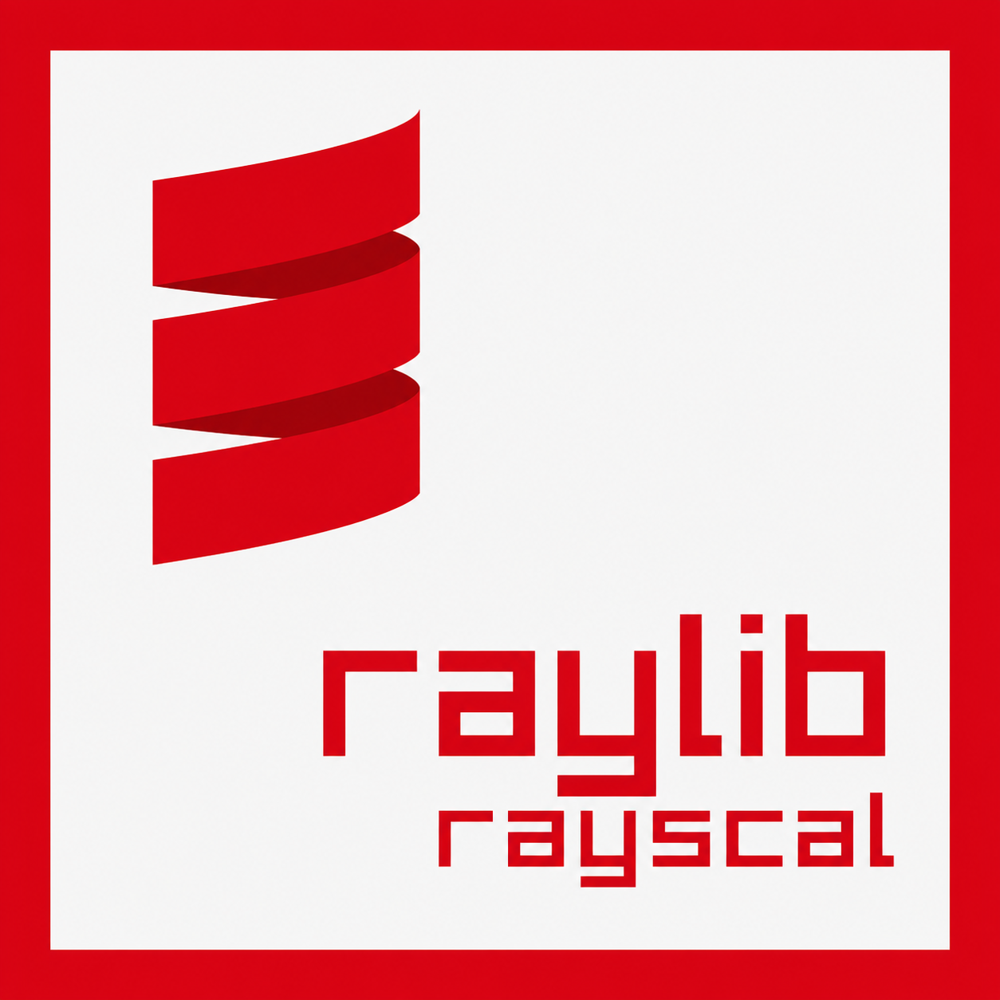

### rayscal
> a tiny **rascal** of a binding for raylib!

Scala Native bindings for [raylib](https://www.raylib.com/) 6.0.

[](https://github.com/RobertFlexx/rayscal/actions)
[](https://scala-lang.org)
[](https://scala-native.org)
[](https://www.raylib.com/)
[](LICENSE)

rayscal wraps raylib's C API in idiomatic Scala, producing a single native binary
via Scala Native. Friendly values are Scala-owned (safe to store and return);
struct-by-value FFI goes through pointer-based C shims. Resource handles use
explicit unload / `with...` scoping.

> ***VERY*** early experimental beta! expect things to **break**, and code to be **unfinished** or **unsafe**. im one guy, and yet to test.
<br clear="left"/>

---

## What's in the box

- Window management, timing, FPS
- 2D drawing: shapes, text, textures, render targets
- 3D drawing: basic primitives, models, cameras
- Input: keyboard, mouse, gamepad, touch, gestures
- Audio: sound effects, music streams
- Shaders: typed uniform setters (float, vec2/3/4, int, matrix, texture)
- Image loading, generation, and manipulation
- Collision detection (2D and 3D raycasts)
- rlgl access for low-level OpenGL-style drawing
- raymath extern declarations (ready for a friendly wrapper layer)

Resource-owning types (`Texture2D`, `Shader`, `Sound`, `Music`, `Model`, `Font`,
`RenderTexture2D`) are managed handles with `with...` helpers for scoped
lifetimes. Use-after-unload fails fast; double-unload is a no-op.

## Quick example

```scala
import rayscal.*

@main def run(): Unit =
  Window.withWindow(800, 450, "hello rayscal"):
    Window.setTargetFps(60)

    while !Window.shouldClose do
      Drawing.frame:
        Drawing.clear(Colors.RAYWHITE)
        Drawing.text("Hello from rayscal!", 220, 200, 28, Colors.DARKGRAY)

        if Keyboard.isDown(Keys.Space) then
          Shapes.circle(400, 280, 48, Colors.SKYBLUE)
        else
          Shapes.circleLines(400, 280, 48, Colors.BLUE)
```

Build and run the hello example from the repository root:

```bash
sbt helloWindow/run
```

(`sbt run` alone does not work here — the root project is an aggregate, not an
executable example.)

## Supported versions

| Component | Status |
|---|---|
| **raylib** | **6.0.x required** (enforced at build time via `pkg-config`) |
| **Scala** | **3.8.4** pinned and tested in this repository |
| **Scala Native** | **0.5.12** pinned and tested in this repository |
| **sbt** | **1.12.14** pinned and tested in this repository |
| **JDK** | **17+** minimum; **21** (Temurin) used in CI |
| **LLVM / Clang** | **16+** recommended (Scala Native 0.5.12 deprecates older toolchains) |
| **OS / arch** | **Linux x86_64** tested in CI (Ubuntu, X11 via Xvfb) |

Other Scala 3.8.x / Scala Native 0.5.x combinations, other Linux setups, Wayland,
macOS, and Windows may work but are **not** tested here. Do not assume broad
production support beyond what CI verifies.

rayscal targets **Scala Native** only. JVM-only Java bindings such as jaylib are
not a substitute for Scala Native applications.

## Requirements

- JDK 17+ (CI uses Temurin 21)
- sbt 1.12.14 (see `project/build.properties`)
- Scala Native toolchain: Clang / LLVM **16+** recommended (lld)
- raylib 6.0 installed as a shared library
- Linux with a working display (or Xvfb for headless CI-style runs)

See [BUILDING.md](BUILDING.md) for detailed setup instructions, troubleshooting,
`publishLocal` dependency usage, and how to use rayscal from your own sbt
project.

---

## CI / verification

```bash
./.github/check-ffi-safety.sh   # static checks: no public CStruct aliases / escaping stackalloc
sbt clean
sbt core/compile
sbt ffiSafety/run               # deterministic headless ABI + ownership assertions
sbt check                       # compile, ffiSafety, abiCheck, link all examples
```

Headless `ffiSafety` must pass with real assertions (nonzero exit on failure).
Graphical `abiCheck` is a separate smoke test that opens a tiny window (CI runs
it under Xvfb).

## Examples

| Example | What it shows |
|---|---|
| `ffiSafety` | Deterministic headless FFI / ownership assertions |
| `abiCheck` | Graphical ABI smoke test (tiny window) |
| `helloWindow` | Minimal window with centered text |
| `bouncingBall` | Frame-rate-independent movement |
| `keyboardInput` | Key state queries |
| `rlglTriangle` | Low-level rlgl immediate mode |
| `shapesGallery` | 2D shapes and mouse picking |
| `textureChecker` | Generated textures |
| `basic3d` | 3D primitives with a camera |
| `camera2d` | 2D camera with zoom/pan |
| `renderTexture` | Draw-to-texture (offscreen rendering) |
| `starRescue` | Complete arcade game with fixed timestep |

Run any example with `sbt <name>/run`, for example:

```bash
sbt starRescue/run
```

## Project structure

```
rayscal/
  modules/core/
    src/main/scala/rayscal/
      # Friendly wrappers
      Window.scala          # window lifecycle, DPI, fullscreen
      Drawing.scala         # frame(), text, clear, mode2D/3D, shader/blend/scissor
      Colors.scala          # named colors, rgba(), color utilities
      Types.scala           # Scala-owned Color/Vector/Rectangle/Camera/... values
      NativeMarshal.scala   # Zone-scoped native marshaling for FFI calls
      Shapes.scala          # 2D primitives (circles, rectangles, triangles, etc.)
      Shapes3D.scala        # 3D primitives (cubes, spheres, cylinders, etc.)
      Input.scala           # Keyboard, Mouse, Gamepads, Touch, Gestures
      Textures.scala        # load, draw, filter, wrap, cubemaps
      Fonts.scala           # custom font loading and rendering
      Audio.scala           # Waves, Sounds, MusicStreams with scoped lifetimes
      Models.scala          # load/generate 3D models, material overrides
      Shaders.scala         # load, typed uniforms (float, vec2/3/4, int, matrix, texture)
      RenderTargets.scala   # offscreen rendering to texture
      Collisions.scala      # 2D and 3D collision/raycast queries
      Camera.scala          # Camera2D/Camera3D construction, update modes
      ScreenSpace.scala     # world-to-screen / screen-to-world conversion
      Rlgl.scala            # rlgl matrix stack, immediate mode, render state
      Vector.scala          # factory methods for Vector2/3/4
      Rect.scala            # rectangle utilities
      Time.scala            # frame time, elapsed time
      Utils.scala           # dropped files, paths
      ManagedResources.scala # managed handle classes
      RaylibAbi.scala       # sizeof/field layout validation against raylib C
    src/main/scala/rayscal/raw/
      Raylib.scala          # FFI-safe @extern decls (no struct-by-value)
      Rlgl.scala            # @extern declarations for rlgl
      RayscalNative.scala   # @extern declarations for C shim layer
      RaymathNative.scala   # @extern declarations for raymath
      package.scala         # raw CStruct layouts (internal)
    src/main/resources/scala-native/
      rayscal.c             # C shims for ABI-sensitive struct-by-value calls
  examples/                 # example programs + ffi-safety / abi-check
  .github/check-ffi-safety.sh
```

---

## Architecture

rayscal has three layers:

**1. `rayscal.*` -- friendly Scala-owned API**

Public plain values (`Color`, `Vector2`, `Rectangle`, cameras, rays, …) are
immutable Scala case classes. They are safe to retain, store in collections,
and return from methods. They are **not** views into temporary native memory.

Resource types (`Image`, `Texture2D`, `Shader`, `Font`, `Model`, `Wave`,
`Sound`, `Music`, `RenderTexture2D`) are explicit ownership wrappers: load once,
unload once, and use-after-unload throws. Prefer `with...` helpers for scoped
lifetimes.

**2. `rayscal.raw.RayscalNative` -- pointer-based C shims**

Scala Native cannot reliably pass or return C structs by value across the FFI
boundary. `rayscal.c` unwraps pointers, calls raylib's by-value C API, and
writes struct returns into caller-provided output pointers.

Friendly wrappers marshal Scala values into short-lived Zone allocations only
for the duration of each native call, then copy results back into Scala-owned
values before the Zone ends.

**3. `rayscal.raw` -- advanced / unsafe details**

`raw.Raylib` exposes only FFI-safe declarations (primitives, pointers, C
strings). Struct-by-value raylib entry points are not declared there. Raw
`CStruct` layouts live in `rayscal.raw` for marshaling and ABI checks; do not
treat them as the public value API.

### Ownership rules

- Plain values: freely copyable Scala data.
- GPU/CPU resources: owned handles with `unload` / `close`; double-unload is a
  no-op; use after unload fails fast.
- Borrowed views (`TextureView` into a `RenderTexture2D`) do not own GPU memory.

## Using assets

Put assets next to your project and load them by path:

```scala
import rayscal.*

@main def run(): Unit =
  Window.withWindow(800, 450, "Textures"):
    Textures.withTexture("assets/player.png"): player =>
      Window.setTargetFps(60)

      while !Window.shouldClose do
        Drawing.frame:
          Drawing.clear(Colors.RAYWHITE)
          Textures.draw(player, 100, 100, Colors.WHITE)
```

`with...` helpers guarantee cleanup. The texture is unloaded when the block
exits, even if an exception is thrown.

## Shader uniforms

```scala
Shaders.withShaderFromMemory(vertexCode, fragmentCode): shader =>
  val timeLoc = Shaders.location(shader, "time")
  val tintLoc = Shaders.location(shader, "tint")

  while !Window.shouldClose do
    Drawing.frame:
      Shaders.setFloat(shader, timeLoc, Time.elapsed.toFloat)
      Shaders.setVector3(shader, tintLoc, Vector.vector3(1.0f, 0.7f, 0.4f))
```

Available setters: `setFloat`, `setVector2`, `setVector3`, `setVector4`,
`setInt`, `setInts`, `setMatrix`, `setTexture`.

## Raw access

For scalar raylib functions without a friendly wrapper:

```scala
import rayscal.raw.Raylib
import scala.scalanative.unsafe.*

Zone:
  Raylib.SetWindowTitle(toCString("New title"))
```

For anything that takes or returns a C struct, use `RayscalNative` pointer
shims (or extend `rayscal.c`) — do not add by-value `@extern` declarations.

---

## Links

- [BUILDING.md](BUILDING.md) -- build instructions, project setup, troubleshooting
- [CONTRIBUTING.md](CONTRIBUTING.md) -- binding and ownership rules for contributors
- [raylib documentation](https://www.raylib.com/)
- [Scala Native](https://scala-native.org)
- [raylib GitHub](https://github.com/raysan5/raylib)
- [GitHub Releases](https://github.com/RobertFlexx/rayscal/releases)

---

## License

MIT. See [LICENSE](LICENSE).
